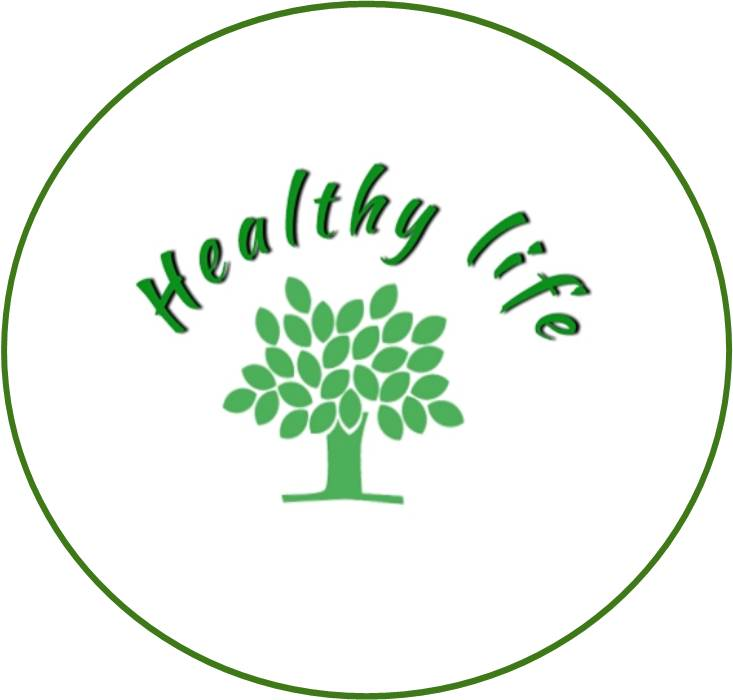
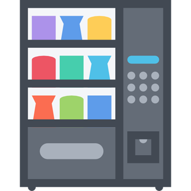
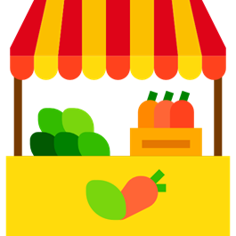
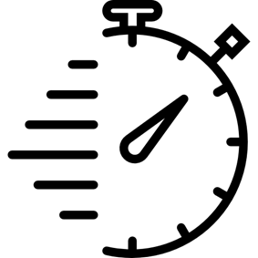
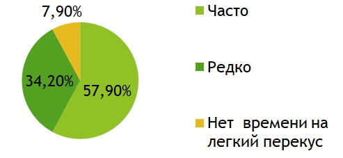
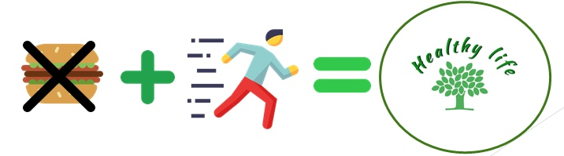
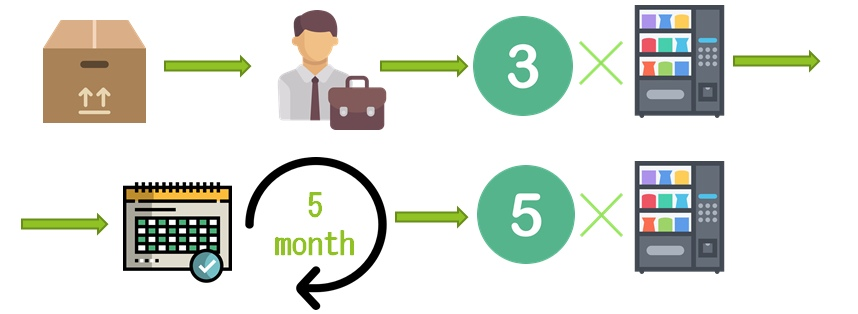
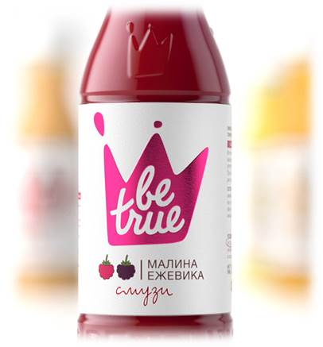
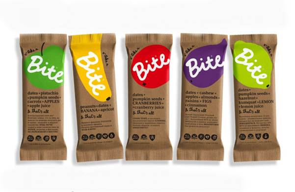
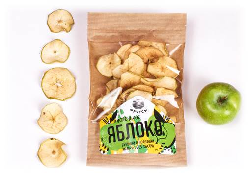

<!doctype html>
<html lang="en">
<head>
	<!-- Required meta tags -->
	<meta charset="utf-8">
	<meta name="viewport" content="width=device-width, initial-scale=1, shrink-to-fit=no">

	<!-- Bootstrap CSS -->
	<link rel="stylesheet" href="https://stackpath.bootstrapcdn.com/bootstrap/4.3.1/css/bootstrap.min.css" integrity="sha384-ggOyR0iXCbMQv3Xipma34MD+dH/1fQ784/j6cY/iJTQUOhcWr7x9JvoRxT2MZw1T" crossorigin="anonymous">
	<link rel="stylesheet" href="css/style.css">

	<title>Hello, world!</title>
</head>
<body>
	<header class="container">
		<nav class="navbar navbar-expand-lg navbar-light bg-white">
			<a class="navbar-brand" href="">Healthy life</a>
			<button class="navbar-toggler" type="button" data-toggle="collapse" data-target="#navbarNav" aria-controls="navbarNav" aria-expanded="false" aria-label="Toggle navigation">
				
			</button>
			

				<ul class="navbar-nav ml-auto">
					<li class="nav-item">
						<a class="nav-link" href="#products">Products</a>
					</li>
					<li class="nav-item">
						<a class="nav-link" href="#bus_con">Business Concept</a>
					</li>
					<li class="nav-item">
						<a class="nav-link" href="#goals">Goals</a>
					</li>

				</ul>
			

		</nav>
	</header>
	<main class="container">
			

				
<strong>Кто мы и что хотим сделать?</strong>

				
Мы хотим сделать здоровье доступным с помощью торговых автоматов по продаже правильных перекусов! Наша миссия состоит в том, чтобы помогать людям делать простые шаги к здоровому образу жизни.
				

				
			

			

				
<strong>Возможности</strong>

				
				
Катастрофическая нехватка времени — одна из центральных проблем в жизни современного человека. Установив наши автоматы в тц, офисах и спорт залах, мы решим эту проблему, предложив большой ассортимент продуктов. 
				

				
			

			

				
<strong>Бизнес-концепция</strong>

				
Мы продаем быстрые и здоровые перекусы!
				

				

					<ul id="3" class="h4">
						
<strong>Для нас важно:</strong>

						<li>Чтобы все продукты были свежие и полезные </li>
						<li>Стерильность упаковки</li>
						<li>Быстрота покупки </li>
					</ul>
				

				
				
				
			

			

				
<strong>Анализ Рынка</strong>

				
Хотя рынок вендинга в России только развивается. Наш проект актуален на рынке как сейчас, так и в будущем. Ведь себестоимость продукции низкая, ожидается развитие вендинга, по результатам опроса люди готовы покупать у нас.
				

				
			

			

				
<strong>Конкуренты</strong>

				
				
Главными конкурентами являются магазины правильного питания и кафе быстрого приготовления. Наша компания включает в себя продажу продуктов питания для быстрого и здорового перекуса. Теперь можно питаться правильно не тратя на это время. Именно это дает нам преимущество перед своими конкурентами.
				

			

			

				
<strong>Цели и задачи</strong>

				

					<ul id="3" class="h4">
						<li>Найти поставщиков товара </li>
						<li>Найти сотрудников</li>
						<li>Установить 3 автомата</li>
						<li>Полная окупаемость оборудования за 1 месяц</li>
						<li>Установка еще 5 автоматов</li>
					</ul>
				

				
			

			

				
<strong>Продукты</strong>

				

					
					<strong>Название:</strong> "Смузи Be true"
					 
					<strong>Приблизительная стоимость ~</strong> 100р
				

				

					
					<strong>Название:</strong> "Батончики Bite"
					 
					<strong>Приблизительная стоимость ~</strong> 50р
				

				

					
					<strong>Название:</strong> "Батончики Bite"
					 
					<strong>Приблизительная стоимость ~</strong> 150р
				

			

	</main>

	<footer class="footer-fluid">
      

        
Связаться с нами можно по ссылке: <a href="https://vk.com/bogdanovaa19">vk.com/bogdanovaa19</a>

        
©2019

      

    </footer>
    
	<!-- Optional JavaScript -->
	<!-- jQuery first, then Popper.js, then Bootstrap JS -->
	

	
 <!--  
 	 -->
 </body>
 </html>